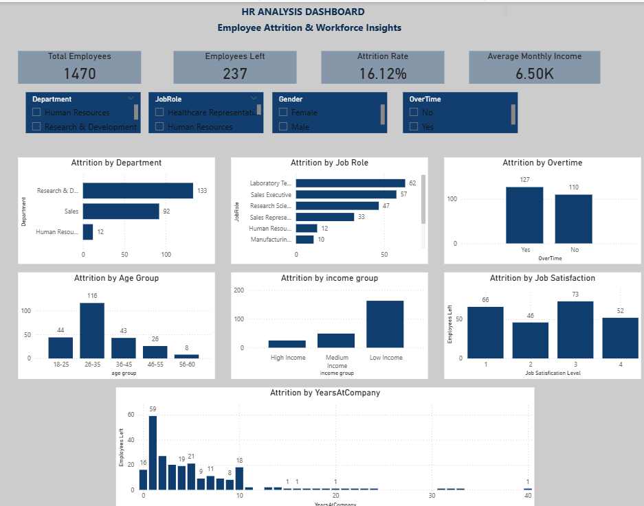

HR-Attrition-Analysis
HR Employee Attrition Analysis using Excel, Power BI and DAx

📌 Project Overview

This project focuses on analyzing employee attrition using HR data to identify workforce patterns and understand factors that may contribute to employee turnover.
The project follows a complete Data Analyst workflow using Excel, Power BI, and DAX.

Workflow:

Raw Data → Data Cleaning → Data Analysis → Power BI Dashboard → Insights

Project Objectives

- Analyze overall employee attrition.
- Identify attrition patterns across departments.
- Analyze employee attrition by job role.
- Understand the relationship between overtime and attrition.
- Analyze attrition across different age groups.
- Analyze attrition based on job satisfaction.
- Study the relationship between income and attrition.
- Analyze attrition based on years at company.
- Create an interactive dashboard for HR analysis.
  
 Tools & Technologies

- Microsoft Excel
- Power BI
- DAX
- Data Cleaning
- Data Analysis
- Data Visualization
- Dashboard Development

 📂 Dataset

The dataset contains employee-level HR information such as:

- Employee Number
- Age
- Gender
- Department
- Job Role
- Monthly Income
- Job Satisfaction
- Overtime
- Years at Company
- Attrition
- Business Travel
- Education
- Job Level
- Work-Life Balance

Total Employees Analyzed: 1,470

 Data Cleaning

Data cleaning and preparation were performed using Microsoft Excel.

The process included:

- Checking for missing values
- Checking for duplicate records
- Validating employee identifiers
- Checking data consistency
- Reviewing numerical values
- Creating Age Group
- Creating Income Group
- Correcting inconsistent category names
- Preparing the cleaned dataset for Power BI

 Power BI Dashboard

The interactive Power BI dashboard includes the following KPIs:

- Total Employees: 1,470
- Employees Left: 237
- Attrition Rate: 16.12%
- Average Monthly Income: 6.50K

 Dashboard Analysis

The dashboard analyzes employee attrition based on:

- Department
- Job Role
- Overtime
- Age Group
- Job Satisfaction
- Income Group
- Years at Company

 Interactive Slicers

Users can dynamically filter the dashboard using:

- Department
- Job Role
- Gender
- Overtime

DAX Measures
 Total Employees

DAX
Total Employees =
DISTINCTCOUNT('HR analysis'[EmployeeNumber])

 Employees Left

DAX
Employees Left =
CALCULATE(
    DISTINCTCOUNT('HR analysis'[EmployeeNumber]),
    'HR analysis'[Attrition] = "Yes"
)
 Attrition Rate

DAX
Attrition Rate =
DIVIDE(
    [Employees Left],
    [Total Employees],
    0
)

 Average Monthly Income
 DAX
Average Monthly Income =
AVERAGE('HR analysis'[MonthlyIncome])

💡 Key Insights

The dashboard helps HR teams understand:

* Departments with higher employee attrition.
* Job roles with higher employee turnover.
* The impact of overtime on employee attrition.
* Attrition patterns across different age groups.
* The relationship between job satisfaction and attrition.
* Attrition patterns across different income groups.
* The relationship between employee tenure and attrition.

 📸 Dashboard Preview

 📁 Project Structure
 
HR-Attrition-Analysis/
│
├── README.md
├── Data/
│   ├── HR_Attrition_Raw.xlsx
│   └── HR_Attrition_Cleaned.xlsx
├── PowerBI/
│   └── HR_Attrition_Dashboard.pbix
├── Screenshots/
│   └── HR_Attrition_Dashboard.png

Project Workflow

Raw HR Data
     ↓
Excel Data Cleaning
     ↓
Data Validation
     ↓
Derived Columns
     ↓
Power BI
     ↓
DAX Measures
     ↓
Interactive Dashboard
     ↓
HR Attrition Insights

Skills Demonstrated

* Data Cleaning
* Data Analysis
* Excel
* Power BI
* DAX
* Data Visualization
* Dashboard Development
* Exploratory Data Analysis
* Business Intelligence

 👩‍💻 Author

Gayathri R

